<p align="center">
  
</p>

<h1 align="center">Hi, I'm foxy7t</h1>

<h3 align="center">Python builder, AI experimenter, and full-stack app maker</h3>

<p align="center">
  <a href="https://github.com/foxy7t">
    
  </a>
  <a href="https://github.com/foxy7t?tab=repositories">
    
  </a>
</p>

---

## About Me

I like building practical software with a cinematic edge: AI assistants, computer-vision tools, mobile app concepts, automation systems, and polished developer experiences.

- Currently building with Python, React Native, FastAPI-style backends, AI tooling, and computer vision.
- Interested in voice agents, MCP tools, fitness tech, productivity systems, and real-time visual apps.
- I care about projects that feel complete: clean README, runnable setup, thoughtful UI, and useful behavior.

---

## Featured Projects

<table>
  <tr>
    <td width="50%">
      <h3>Sleep Detector</h3>
      <p>Desktop drowsiness-monitoring app using MediaPipe Face Landmarker, OpenCV, and CustomTkinter.</p>
      <p>
        <a href="https://github.com/foxy7t/sleep-detector">Repository</a>
      </p>
    </td>
    <td width="50%">
      <h3>F.R.I.D.A.Y. Voice Assistant</h3>
      <p>MCP-powered Tony Stark inspired voice assistant with LiveKit, tool calling, news, web fetches, and system utilities.</p>
      <p>
        <a href="https://github.com/foxy7t/friday-tony-stark-demo">Repository</a>
      </p>
    </td>
  </tr>
  <tr>
    <td width="50%">
      <h3>FitTrackAI</h3>
      <p>Expo Router fitness app concept with workout tracking, analytics, onboarding, and an AI coach chat experience.</p>
      <p>
        <a href="https://github.com/foxy7t/buildup">Repository</a>
      </p>
    </td>
    <td width="50%">
      <h3>More Experiments</h3>
      <p>Prototypes and demos across AI, Android, web apps, automation, and developer tooling.</p>
      <p>
        <a href="https://github.com/foxy7t?tab=repositories">All repositories</a>
      </p>
    </td>
  </tr>
</table>

---

## Tech Stack

<p align="center">
  
</p>

<p align="center">
  
  
  
  
</p>

---

## GitHub Analytics

<p align="center">
  
  
</p>

<p align="center">
  
</p>

---

## Current Focus

```text
AI assistants      -> voice agents, MCP tools, useful automation
Computer vision    -> webcam apps, OpenCV, MediaPipe workflows
Product UI         -> React Native, Expo, polished app experiences
Backend systems    -> Python services, APIs, structured project setup
```

<p align="center">
  <b>Building practical software, one experiment at a time.</b>
</p>
